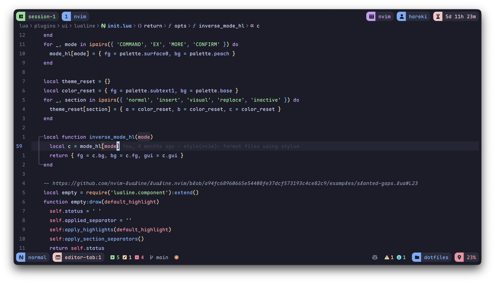

## My Personal Neovim Config



**lazy.nvim** config built from scratch. Optimized for fast cold start, per-plugin isolation, consistent floating UX, and minimal-diff forks.

> [!NOTE]
> WIP. Structure & forks may change.

### Core Ideas

- One plugin per file under `lua/plugins/{core,chrome,features}/`
- On-demand loading via keymaps or `VeryLazy` event
- Startup: ~38ms (dashboard) / ~50ms (open file) via `:Lazy profile`
- Unified floating layout across Snacks picker, Telescope, floating nvim-tree
- **Tab** = toggle focus (list↔preview, float↔main); **`<C-t>`** = toggle side-panel mode

### Architecture

#### Central Modules (`lua/config/`)

| Module        | Purpose                                                   |
| ------------- | --------------------------------------------------------- |
| `size.lua`    | Popup dimensions: `sm`, `md`, `lg`, `vertical_lg`, `full` |
| `icons.lua`   | All icons (diagnostics, git, file status, LSP kinds)      |
| `globals.lua` | `_G.Notifier` and `_G.Defer` lazy proxies                 |
| `picker.lua`  | Shared picker UI constants                                |

#### Utils (`lua/utils/`)

| Module             | Key Exports                                             |
| ------------------ | ------------------------------------------------------- |
| `ui.lua`           | `popup_config(size)`, `catppuccin(fn)`, `get_palette()` |
| `common.lua`       | `noautocmd(fn)`, `focus_win(win)`, `is_float_win()`     |
| `lazy-require.lua` | `Defer.on_index()`, `Defer.on_exported_call()`          |

#### Services (`lua/services/`)

| Module         | Purpose                                                                          |
| -------------- | -------------------------------------------------------------------------------- |
| `notifier.lua` | Wrapper around nvim-notify; supports markdown, tuple lists for custom highlights |

#### Complex Plugin Structure

Plugins requiring state management use this pattern:

```
nvim-tree/
  init.lua   -- Returns table: [1] catppuccin highlights, [2] plugin spec
  utils.lua  -- M.state = {} table + helper functions
```

#### LSP & Formatting

- Per-server configs in `lua/plugins/core/lsp/nvim-lspconfig/lsp/{server}.lua`
- Mason handles tool installation via `lua/plugins/core/lsp/mason.nvim.lua`
- Single async formatting pipeline in `utils/formatters/async_style_enforcer.lua`

### Forks (author = hareki)

- 15+ minimal-diff forks; updated via [wei/pull](https://github.com/wei/pull)
- Features toggleable — disabling custom bits reverts to upstream behavior
- Enable unified UX by exposing layout hooks, focus toggles, and preview coordination

### Code Style

- stylua: 100-char lines, 2-space indent
- LuaLS `---@class` / `---@param` / `---@return` annotations for public APIs
- All keymaps include `desc` in CMOS 18 title case
- Icons imported from `config/icons.lua` — never hardcoded

### Attribution

Ideas borrowed from Kickstart & LazyVim; all tailoring is personal workflow oriented.
