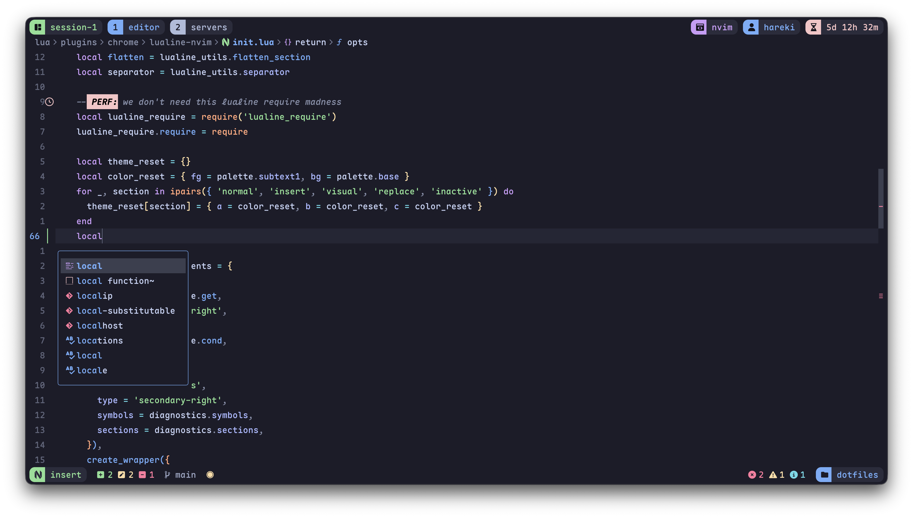

# My Personal Neovim Config



**lazy.nvim** config built from scratch. Optimized for fast cold start, per-plugin isolation, consistent floating UX, and minimal-diff forks.

## Requirements

### System

| Dependency                                          | Required By                                             | Notes                                                           |
| --------------------------------------------------- | ------------------------------------------------------- | --------------------------------------------------------------- |
| [Neovim](https://neovim.io/) 0.12+                  | —                                                       | Native `vim.lsp.enable()` API                                   |
| [Git](https://git-scm.com/)                         | gitsigns.nvim, lazygit, blink-ripgrep (gitgrep backend) | —                                                               |
| [Nerd Font](https://www.nerdfonts.com/)             | mini.icons, lualine, which-key, nvim-tree, etc.         | All icons are Nerd Font glyphs                                  |
| [ripgrep](https://github.com/BurntSushi/ripgrep)    | Snacks picker, Telescope, blink-ripgrep                 | File search and grep                                            |
| [fd](https://github.com/sharkdp/fd)                 | Telescope                                               | Fallback file finder (after ripgrep)                            |
| [delta](https://github.com/dandavison/delta)        | tiny-code-action.nvim, Telescope undo                   | Diff previews                                                   |
| [jq](https://jqlang.github.io/jq/)                  | jsonls                                                  | Optional — JSON sorting code action                             |
| [lazygit](https://github.com/jesseduffield/lazygit) | Snacks (`<A-g>`)                                        | Terminal UI for Git                                             |
| [ImageMagick](https://imagemagick.org/)             | image.nvim                                              | `magick_cli` processor                                          |
| [kitty](https://sw.kovidgoez.net/kitty/)            | image.nvim                                              | Terminal with image protocol support                            |
| C compiler + make                                   | nvim-treesitter, telescope-fzf-native                   | Parser compilation                                              |
| [Go](https://go.dev/)                               | cursortab.nvim                                          | Build step: `cd server && go build`                             |
| [Node.js](https://nodejs.org/) + npm                | mise-managed LSP servers (vtsls, eslint-lsp, etc.), vtsls LSP config | mise installs Node-based LSP servers; vtsls runs `npm root -g` |

### Subscriptions & API Keys

| Dependency                                                         | Required By                                    | Notes                                    |
| ------------------------------------------------------------------ | ---------------------------------------------- | ---------------------------------------- |
| [GitHub Copilot](https://github.com/features/copilot) subscription | copilot.lua, blink-copilot, ai-commit-msg.nvim | Inline completions + AI commit messages  |
| [Claude Code](https://claude.ai/download) CLI + subscription       | claudecode.nvim                                | `<M-a>` to toggle Claude terminal        |
| `SWEEPAPI_TOKEN` env var                                           | cursortab.nvim                                 | SweepAPI token for next-edit predictions |

## Core Ideas

- One plugin per file under `lua/plugins/{core,chrome,features}/`
- On-demand loading via keymaps or `VeryLazy` event
- Startup: ~38ms (no session or blank file) / ~80ms (opening file or directory with session) via `:Lazy profile`
- Unified floating layout across Snacks picker, Telescope, floating nvim-tree
- **Tab** = toggle focus (list↔preview, float↔main); **`<C-t>`** = toggle side-panel mode

## Architecture

### Central Modules (`lua/config/`)

| Module        | Purpose                                                   |
| ------------- | --------------------------------------------------------- |
| `size.lua`    | Popup dimensions: `sm`, `md`, `lg`, `vertical_lg`, `full` |
| `icons.lua`   | All icons (diagnostics, git, file status, LSP kinds)      |
| `globals.lua` | 8 project globals: `Defer`, `Notifier`, `Catppuccin`, `WhichKey`, `Filetypes`, `Icons`, `Priority`, `Project` |
| `picker.lua`  | Shared picker UI constants                                |

### Utils (`lua/utils/`)

| Module             | Key Exports                                             |
| ------------------ | ------------------------------------------------------- |
| `ui.lua`           | `popup_config(size, with_border)`, `catppuccin(fn)`, `get_palette()` |
| `common.lua`       | `noautocmd(fn)`, `focus_win(win)`, `is_float_win()`     |
| `lazy_require.lua` | `Defer.on_index()`, `Defer.on_exported_call()`          |

### Services (`lua/services/`)

| Module                | Purpose                                                                          |
| --------------------- | -------------------------------------------------------------------------------- |
| `notifier.lua`        | Notification wrapper; supports markdown, tuple lists for custom highlight groups  |
| `blink_cmp.lua`       | Completion tuning constants (AI cmp item cap/timeout, ripgrep min keyword length) |
| `cursorline.lua`      | Cursorline / line-number highlight state management                              |
| `keymap_registry.lua` | Centralized keymap `desc` overrides                                              |
| `statusline.lua`      | Statusline visibility helpers (`have_status_line()`)                             |

### Complex Plugin Structure

Plugins requiring state management use this pattern:

```
nvim-tree-lua/
  init.lua   -- Returns table: [1] catppuccin highlights, [2] plugin spec
  utils.lua  -- M.state = {} table + helper functions
```

### LSP & Formatting

- Per-server configs in `lua/plugins/core/lsp/nvim-lspconfig/lsp/{server}.lua`
- Tool installation (LSP servers, formatters, linters) is handled by [mise-en-place](https://mise.jdx.dev/) via `~/.config/mise/config.toml`
- Async style-enforcement pipeline (formatters + linters) in `utils/style_enforcers/`

## Forks (author = hareki)

- 17 minimal-diff forks; updated via [wei/pull](https://github.com/wei/pull)
- Features toggleable — disabling custom bits reverts to upstream behavior
- Enable unified UX by exposing layout hooks, focus toggles, preview coordination, UI tweaks and more.

## Code Style

- stylua: 100-char lines, 2-space indent
- LuaLS `---@class` / `---@param` / `---@return` annotations for public APIs
- All keymaps include `desc` in CMOS 18 title case
- Icons imported from `config/icons.lua` — never hardcoded

## Attribution

Inspired by [kickstart.nvim](https://github.com/nvim-lua/kickstart.nvim), [LazyVim](https://github.com/LazyVim/LazyVim) and [NvChad](https://github.com/NvChad/NvChad).
