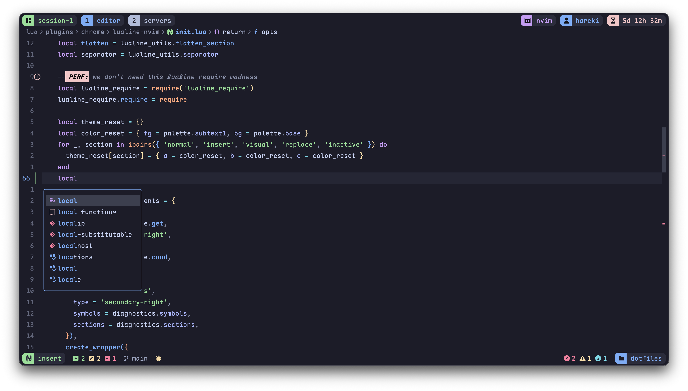

# My Personal Neovim Config



**lazy.nvim** config built from scratch. Optimized for fast cold start, per-plugin isolation, consistent floating UX, and minimal-diff forks.

## Requirements

### System

- **[Neovim](https://neovim.io/) 0.12+**: native `vim.lsp.enable()` API
- **[Git](https://git-scm.com/)**: required by gitsigns.nvim, lazygit, blink-ripgrep (gitgrep backend)
- **[Nerd Font](https://www.nerdfonts.com/)**: all icons are Nerd Font glyphs (mini.icons, lualine, which-key, nvim-tree, etc.)
- **[ripgrep](https://github.com/BurntSushi/ripgrep)**: file search and grep for Snacks picker, Telescope, blink-ripgrep
- **[fd](https://github.com/sharkdp/fd)**: fallback file finder for Telescope (after ripgrep)
- **[delta](https://github.com/dandavison/delta)**: diff previews in tiny-code-action.nvim and Telescope undo
- **[jq](https://jqlang.github.io/jq/)** (optional): JSON sorting code action in jsonls
- **[lazygit](https://github.com/jesseduffield/lazygit)**: terminal UI for Git, opened through Snacks (`<A-g>`)
- **[ImageMagick](https://imagemagick.org/)**: `magick` CLI for image rendering in Snacks (`image`)
- **[Ghostty](https://ghostty.org/)**: terminal with kitty graphics protocol support, for Snacks (`image`)
- **C compiler + make**: builds nvim-treesitter parsers and telescope-fzf-native
- **[Go](https://go.dev/)**: build step for cursortab.nvim (`cd server && go build`)
- **[Node.js](https://nodejs.org/) + npm**: mise installs the Node-based LSP servers (vtsls, eslint-lsp, etc.), and the vtsls LSP config runs `npm root -g`

### Subscriptions & API Keys

- **`ANTHROPIC_API_KEY` env var**: Claude-generated commit messages in ai-commit-msg.nvim
- **`MERCURY_API_KEY` env var**: SweepAPI token for next-edit predictions in cursortab.nvim
- **[Claude Code](https://claude.ai/download) CLI + subscription**: Claude terminal in claudecode.nvim, toggled with `<A-a>`

## Core Ideas

- One plugin per file under `lua/{core,chrome,features}/`
- On-demand loading via keymaps or `VeryLazy` event
- Startup: ~38ms (no session or blank file) / ~80ms (opening file or directory with session) via `:Lazy profile`
- Unified floating layout across Snacks picker, Telescope, floating nvim-tree
- **Tab** = toggle focus (list↔preview, float↔main); **`<C-t>`** = toggle side-panel mode

## Architecture

### Central Modules (`lua/config/`)

- `init.lua`: assembles the `Conf` global from the `config.*` tables below
- `size.lua`: popup dimensions (`sm`, `md`, `lg`, `vertical_sm`, `vertical_md`, `full`)
- `icons.lua`: all icons (diagnostics, git, file status, LSP kinds)
- `globals.lua`: 6 project globals (`Defer`, `Notifier`, `Conf`, `UI`, `Project`, plus `Snacks` set by snacks.nvim)
- `cmp.lua`: completion tuning constants in `Conf.cmp` (AI item cap/timeout, ripgrep min keyword length)
- `picker.lua`: shared picker UI constants
- `keymap-registry.lua`: centralized keymap `desc` overrides

### Utils (`lua/utils/`)

- `ui/`: namespaces of the `UI` global
  - `layout.popup(size, with_border)`, `color.blend_hex()`, `pill.virt_text()`, `cursorline.set_cursorline()`
  - `integrations/`: `catppuccin(fn)` / `catppuccin.get_palette()`, `which_key(spec)`, `statusline.refresh()`
- `notifier.lua`: notification wrapper; supports markdown, tuple lists for custom highlight groups
- `common.lua`: `noautocmd(fn)`, `focus_win(win)`, `is_float_win()`
- `lazy-require.lua`: `Defer.on_index()`, `Defer.on_exported_call()`

### Complex Plugin Structure

Plugins requiring state management use this pattern:

```
nvim-tree-lua/
  init.lua   -- Returns table: [1] catppuccin highlights, [2] plugin spec
  utils.lua  -- M.state = {} table + helper functions
```

### LSP & Formatting

- Per-server configs in `lua/core/lsp/nvim-lspconfig/lsp/{server}.lua`
- Tool installation (LSP servers, formatters, linters) is handled by [mise-en-place](https://mise.jdx.dev/) via `~/.config/mise/config.toml`
- Async style-enforcement pipeline (formatters + linters) in `utils/style-enforcers/`

## Forks (author = hareki)

- 19 minimal-diff forks; updated via [wei/pull](https://github.com/wei/pull)
- Features toggleable — disabling custom bits reverts to upstream behavior
- Enable unified UX by exposing layout hooks, focus toggles, preview coordination, UI tweaks and more.

## Code Style

- stylua: 100-char lines, 2-space indent
- LuaLS `--- @class` / `--- @param` / `--- @return` annotations for public APIs
- All keymaps include `desc` in CMOS 18 title case
- Icons imported from `config/icons.lua` — never hardcoded

## Attribution

Inspired by [kickstart.nvim](https://github.com/nvim-lua/kickstart.nvim), [LazyVim](https://github.com/LazyVim/LazyVim) and [NvChad](https://github.com/NvChad/NvChad).
