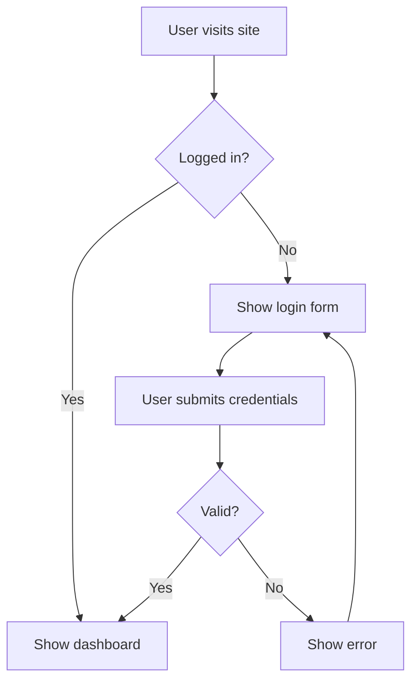

# Simple Mermaid Example

A basic flowchart showing a login flow.

## Notes

- Render this on GitHub, GitLab, or any Markdown viewer that supports Mermaid.
- Change `flowchart TD` to `flowchart LR` for a left-to-right layout.
