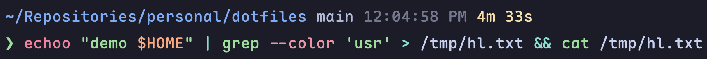

# My Personal ZSH Config



Feature-packed zsh setup with ~110ms startup. Optimized via static plugin bundling, eval caching, bytecode compilation, and function autoloading.

## Core Ideas

- [Antidote](https://github.com/mattmc3/antidote) for static plugin bundling with deferred loading
- [evalcache](https://github.com/mroth/evalcache) to cache expensive `eval` calls (brew, zoxide, atuin, zsh-patina)
- `zcompile` pre-compiles `.zshrc` to bytecode; functions autoload on first call
- Vi mode with OSC52 clipboard integration (works over SSH)
- Catppuccin Mocha theme applied across fzf, zsh-patina syntax highlighting, and eza

## Plugins

| Plugin                                                                  | Purpose                           | Loading           |
| ----------------------------------------------------------------------- | --------------------------------- | ----------------- |
| [powerlevel10k](https://github.com/romkatv/powerlevel10k)               | Prompt theme                      | eager             |
| [zsh-autosuggestions](https://github.com/zsh-users/zsh-autosuggestions) | History-based command suggestions | deferred          |
| zsh-patina (Homebrew binary)                                            | Real-time syntax highlighting     | eager (evalcache) |
| [fzf-tab](https://github.com/Aloxaf/fzf-tab)                            | Fuzzy tab completion              | deferred          |
| [evalcache](https://github.com/mroth/evalcache)                         | Shell eval output caching         | eager             |
| ohmyzsh ssh-agent                                                       | Auto-load SSH keys                | deferred          |

## Config Structure

```
.zshenv                             # Non-interactive: XDG, secrets (keychain), PATH, mise shims
.zshrc                              # Interactive: prompt, plugins, modules
.zplugins                           # Antidote plugin manifest
.config/zsh/
├── aliases.zsh                     # Shell aliases (lg, tree, .., ..., etc.)
├── plugins.zsh                     # Antidote setup + plugin options
├── options.zsh                     # Env vars, history, fzf theme/layout
├── evalcache.zsh                   # Tool init: zoxide, atuin, zsh-patina
├── keymaps.zsh                     # Key bindings (Alt+F → atuin, etc.)
├── vi-mode.zsh                     # Vi mode + OSC52 yank/paste
├── compdef.zsh                     # Custom completions (sync-dots, tv, build, git-bwt, tmuxinator)
└── functions/                      # Autoloaded utility functions (one per file)
```
